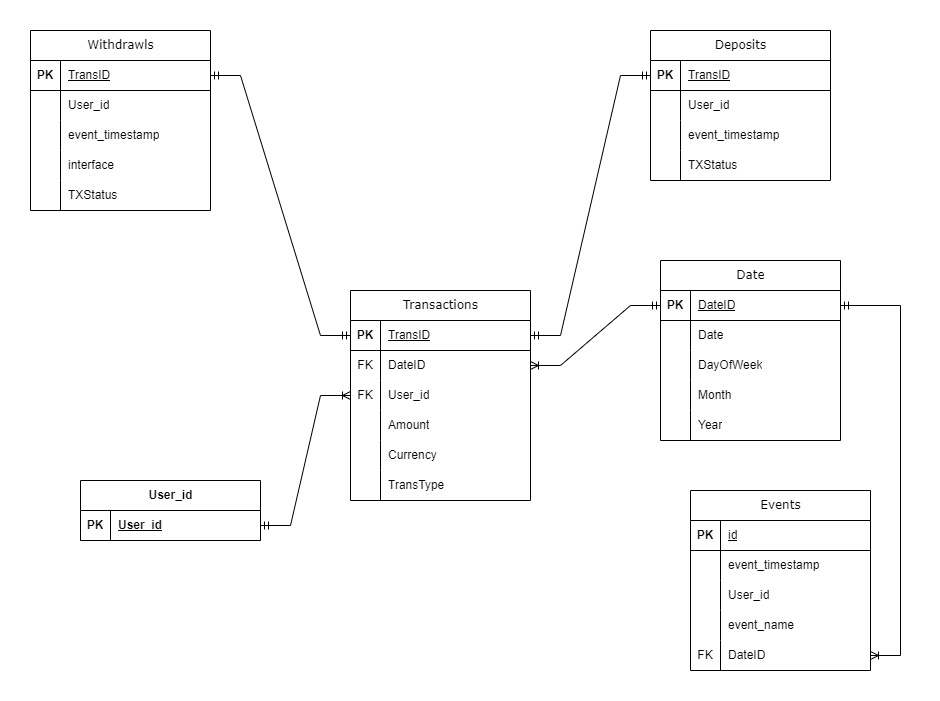

# Challenge 2 SDE Bitso

## Table of Contents
- [Introduction](#introduction)
- [Requirements](#requirements)
- [Installation](#installation)
- [Usage](#usage)
- [Data Model](#datamodel)
- [Entity Relationship Model](#erd)
- [Contributing](#contributing)
- [License](#license)
- [Contact](#contact)

## Introduction
As a data engineer you need to provide master data for our downstream users Business Intelligence,
Machine Learning, Experimentation and Marketing. These teams will use the data for multiple purposes, the tables
and data model you’ll create should help them answer relevant questions.

The repository uses the information in [this url](https://github.com/IMARVI/sr_de_challenge) to fetch the required information, transform it, and save it in CSV format that will help us create tables that will answer the questions needed for the business needs. 

## Requirements
All the dependencies for this project are in the `requirements.txt` file.

## Installation
Follow these steps to set up and run the project locally:

1. Clone the repository:
    ```bash
    git clone https://github.com/leonardovd01/challenge_2_bitso.git
    ```

2. Navigate to the project directory:
    ```bash
    cd challenge_2_bitso
    ```

3. Install the dependencies:
    ```bash
    pip install -r requirements.txt
    ```

## Usage
The project includes a script that processes the raw information and creates the necessary CSV files for table creation.

1. **master_tables.py**:
This script performs the ETL tasks for Challenge 2. It will save six CSV files. You can run it using the following command:
    ```bash
    python master_tables.py

## Data Model Description
This data model is designed to efficiently manage and analyze user transactions and activities within the system. It consists of several interconnected tables, each serving a specific purpose. Below is a detailed breakdown of each table and their roles:

### Users Table
Purpose: Stores unique IDs of users.

#### Fields: 

- UserID: A unique identifier for each user.

### Dates Table
Purpose: Manages date-related information to facilitate time-based analyses.

#### Fields:

- DateID: A unique identifier for each date.

- Date: The actual calendar date.

- DayOfWeek: The day of the week corresponding to the date.

- Month: The month of the year.

- Year: The year.
## Transactions Table
Purpose: Records all financial transactions made by users, tracking the flow of currency.

#### Fields:

- TransID: A unique identifier for each transaction.
- DateID: Links to the Dates table, indicating when the transaction occurred.
- UserID: Links to the Users table, identifying the user involved in the transaction.
- Amount: The monetary amount involved in the transaction.
- Currency: The currency used in the transaction.
- TransType: The type of transaction (e.g., deposit, withdrawal).

### Deposits Table
Purpose: Tracks all deposit transactions.

#### Fields:

- TransID: A unique identifier for each deposit. Links to the Transactions table, providing details about the deposit transaction.
- User_id: Identifier of the user performing the deposit.
- EventTimestamp: The exact timestamp when the event occurred.
- TxStatus: The status of the transaction (e.g., pending, complete).
### Withdrawals Table
Purpose: Tracks all withdrawal transactions.

#### Fields:
- TransID:  Links to the Transactions table, providing details about the withdrawal transaction.
- User_id: Identifier of the user performing the withdrawal.
- EventTimestamp: The exact timestamp when the event occurred.
- Interface: Information about what platform was used to perfom the withdrawal.
- TxStatus: The status of the transaction (e.g., pending, complete).
### Events Table
Purpose: Captures non-financial user activities, such as logins and level change, aiding in behavioral analysis and system monitoring.


#### Fields:

- ID: A unique identifier for each event.
- EventTimestamp: The exact timestamp when the event occurred.
- UserID: Identifier of the user performing the event action.
- Event_name: The type of event (e.g., login, logout, page_view).
- DateID: Links to the Dates table, indicating when the event occurred.

## Entity Relationship Model



## Contributing
Contributions are welcome! Please follow these steps to contribute:

1. Fork the repository
2. Create a new branch (`git checkout -b feature/your-feature`)
3. Commit your changes (`git commit -am 'Add some feature'`)
4. Push to the branch (`git push origin feature/your-feature`)
5. Create a new Pull Request

## License
This project is licensed under the MIT License - see the [LICENSE](LICENSE) file for details.


## Contact
For any questions or inquiries, please contact [leonardovd01](https://github.com/leonardovd01).
